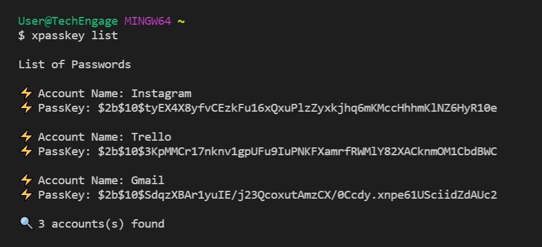
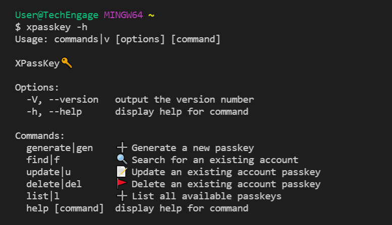

# XPassKey🔑
*🔒Password management made simpler. Generate and store a secure passkey instantly from your command line.*

<p align="center">
   
</p>
<!-- PROJECT LOGO -->

[](https://GitHub.com/Naereen/StrapDown.js/graphs/commit-activity)

<!-- ABOUT THE PROJECT -->

## Built With

<p align="left">
   
   
</p>

## Notable Features

- *Supports **CRUD** functionality for passkeys on MongoDB*
- *User choice to save passkeys to **local text file**.*
- *Generated passkeys are hashed and stored in MongoDB.*
- ***User-based filters** on numeric and symbolic characters.*
- *Generated passskeys are automatically saved to user clipboard.*
---

## 🔥 Screenshots

| **xpasskey gen** |
| - |
|  |

| **xpasskey find** |
| - |
|  |

| **xpasskey update** |
| - |
|  |

| **xpasskey delete** |
| - |
|  |

| **xpasskey list** |
| - |
|  |

| **xpasskey -h** |
| - |
|  |


<!-- BUILT WITH -->  

## How to Install Locally

**1. Fork and clone this repository using**

   ```
   git clone https://github.com/sandip2224/XPassKey.git
   cd XPassKey/
   ```  
   
**2. Install required dependencies using**  

   ```
   npm install
   ```  

**3. Create a global symlink using**  

  ```
  npm link
  ```

## Commands

| **Short** | **Long**              | **Description**                     |
| ----- | ----------------- | ------------------------------- |
| gen    | generate | ➕ Generate a new passkey for an account |
| f    | find            | 🔍 Search for an existing account passkey  |
| u   | update      | 📝 Update an account passkey                |
| del   | delete      | 🚩 Delete a passkey from database                  |
| -h    | --help            | 🚀 Display help for command        |
| -V    | --version         | 🔑 Display the current version                |

---

## :man: Project Maintained By-
  - [Sandipan Das](https://linkedin.com/in/sandipan0164/)

<div align="center">
  
</div>
