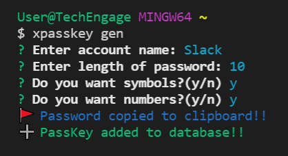
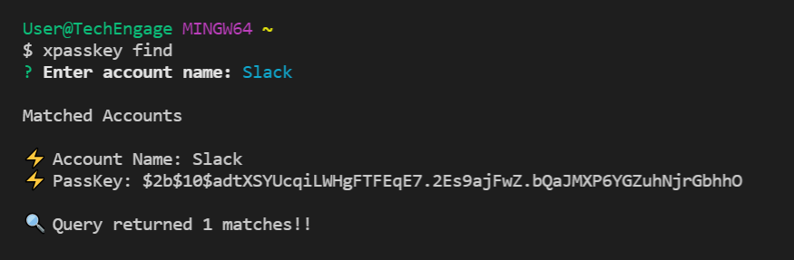
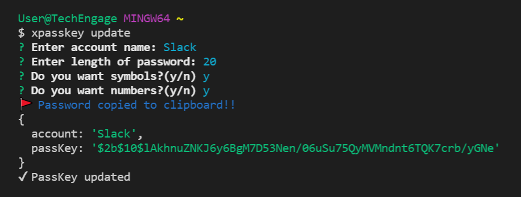
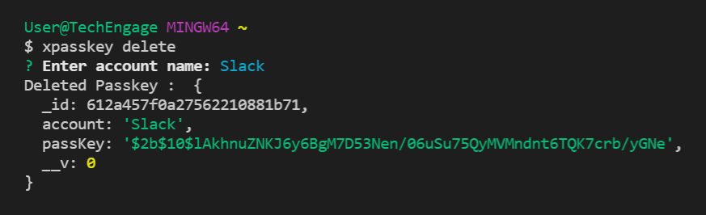

# XPassKey🔑
*🔒Generate a secure passkey directly from your command line.*

<p align="center">
   
</p>
<!-- PROJECT LOGO -->

[](https://GitHub.com/Naereen/StrapDown.js/graphs/commit-activity)

<!-- ABOUT THE PROJECT -->

## Built With

<p align="left">
   
   
   
</p>

## Notable Features

- *Option to save passwords to local text file.*
- *Generated passkeys are hashed and stored in MongoDB.*
- *User-based filters on numeric and symbolic characters.*
- *Generated passskeys are automatically saved to user clipboard.*
---

## 🔥 Screenshots

| **xpasskey** | **xpasskey -ns** |
| - | - |
|  |  |

| **xpasskey -nn** | **xpasskey --list** |
| - | - |
|  |  |


<!-- BUILT WITH -->  

## How to Install Locally

**1. Fork and clone this repository using**

   ```
   git clone https://github.com/sandip2224/XPassKey.git
   cd XPassKey/
   ```  
   
**2. Install required dependencies using**  

   ```
   npm install
   ```  

**3. Create a global symlink using**  

  ```
  npm link
  ```

## Commands

**1. Generate passkey of custom length using**

   ```
   xpasskey --length=<number>
   ```  
   
**2. Generate passkey without numeric characters**  

   ```
   xpasskey --no-numbers
   ```  
   
**3. Generate passkey without symbolic characters**  

   ```
   xpasskey --no-symbols
   ```  
   
**4. Save generated passkey to local text file**  

   ```
   xpasskey --save
   ```  
   
**5. Display hashed passwords in database**  

   ```
   xpasskey --list
   ```  

**6. Clear contents of local passkey text file**  

   ```
   xpasskey --clear
   ```  
---

## Contributing

If you'd like to contribute, please **fork** the repository and then raise a PR with necessary changes. Thank you.

---

## 🤎 Found this project interesting?

If you found this project useful, then please leave a :star: on Github💔.

---

## :man: Project Maintained By-
  - [Sandipan Das](https://linkedin.com/in/sandipan0164/)
